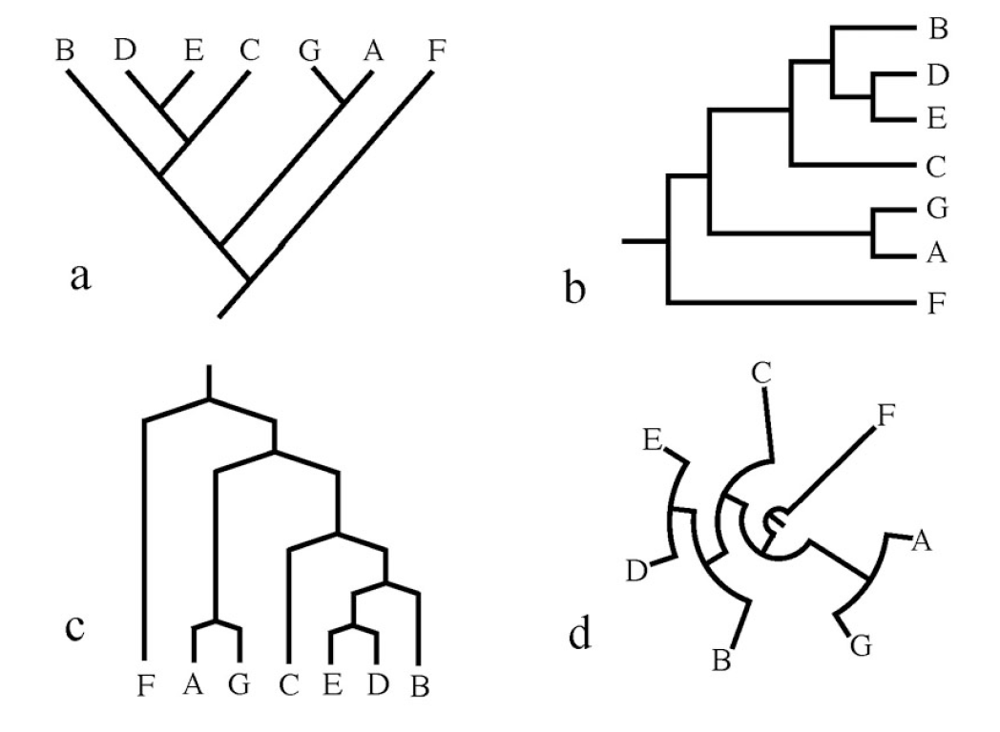

# Linux Basic
___
Many free bioinformatic programs, including those for phylogenetics, are often made by a one or a few academics who don't have the resources to make nice graphical user interfaces (GUI). GUIs are the way most computer users interact with computers, they are the point-and-click apps (e.g., Google chrome, Adobe reader, Microsoft word etc) and the folder navigation system that we all use everyday. Some bioinformatic GUI exist but typically they cost money (i.e., Sequencher, Geneious). Most bioinformatic programs typically lack these graphical "bells and whistles" and instead come in the form of an 'executable.' We'll discuss these more later. Bioinformatic executables are built using the Linux  operating system (OS), this is similar to Mac and Windows but less common among general computer users. Both Linux and Mac OS are largely based on another operating called Unix, as such if you own a Mac you will have the necessary programs built in for some steps below. Windows OS is not Unix based instead, it is MS-DOS so you will need to install some additional programs. 

Linux, Mac and Windows all have a command line interface, this is a way of navigating your computer without a mouse, and how to "run" executables. In the first part of this worksheet we will introduce you to the Linux command line interface, which hopefully will make you'll feel like your a hacker. Additionally, instead of running things locally (i.e., on your own computer) we will run all our analysis on a remote server, this has a few advantages: 

1. Bioinformatics is an increasingly popular discipline and now-a-days a lot of PhD incorporate some sort of computational component. We hope these skill will be helpful to those and if you are planning a fully wetlab PhD consider learning some bioinformatics. I can be useful if there is a possibility of shutting down again! 
2. Running on a server vs. locally is more convenient if you don't ever use phylogenetics again, you'll just have these programs randomly installed.
3. If you will use phylogenetics, in the age of big data, your computer likely doesn't have the computational resource to run things. You'll likely need to use a server anyways.

**An important tip for first timers** If this is your first time using Linux/ coding/ scripting, you might experience some frustration, as you would learning any new skill. My recommendation is to **TAKE IT SLOW**, a single typo, a misplaced period will cause things to completely fail and because you likely lack skills necessary to troubleshoot (aka searching through google for help), you might get super frustrated. As such, read everything carefully, take a lot of deep breaths, take a yoga break, eat some pie, whatever you need to chill out. We are here to help you succeed so please please ask us all the questions! Lastly, I apologize for the typos, my grammar is not very good. If  the instruction are not clear so please ask us questions!

Alrightyyyyyyyy then, let get to it! 

## Programs to Download
* A basic text editor. This is kind of like Microsoft word but way more basic and better! Here are a few options
	* Text editors to download
		* [Sublime](https://www.sublimetext.com/) - My personal preference
		* [Notepad++](https://notepad-plus-plus.org/)
	* Note for Mac users: 
		* You might already have BBedit or TextWrangler installed. Feel free to use those.
		* **DO NOT USE TextEdit**
* [CyberDuck](https://cyberduck.io/), this is a program to upload and download files.
* [FigTree](http://tree.bio.ed.ac.uk/software/figtree/): To visualize your phylogeney 
* **Windows Users:** [putty](https://www.putty.org/): this is a program for remote login

## Remote login
The first step is to log into the server from your computer. Depending on whether you are a Mac/ Linux or Windows user follow the instructions below. Importantly each one of you has a unique username and password. The user name is your, 'net_id@[IP.address]'. The IP address is different for Windows and Mac users, see the instructions below. Your password is your 'first_name6410', first letter capitalized. For example for me: 
* Username: jm2722@[IP_Address]
* Password: Jesus6410

### Windows Users
1. Open putty
2. Type your username and IP address in the specified area. Your IP address is below.
	* 128.253.192.48
3. Type in password. 
4. This should open a black screen with a flashing light that you can type things in.

### Mac/ Linux User
Open the Terminal app. For Mac users it'll be under Applications/Utilities/. This should open a black screen with a flashing light that you can type things in. Type the following line by line, but replace my information with your information. Your IPaddress is '128.253.192.47'. 

```bash
ssh jm2722@128.253.192.47
Jesus6410
```

## Basic Linux Command
Now that you have successfully logged you are all in a Linux environment. We will run through a few basic Linux commands. As I mentioned, Terminal essentially allows you to navigate your computer through a command line rather than a point-and-click folder system. You'll quickly notice that it is not as intuitive as point-and-click. It's rather retro so just pretend you are living in the 80's lol. Linux has a set of built in commands to help you navigate the program which we will go through. 

### Moving around with Linux
In Linux knowing your location (i.e, which folder you are in) is important. Each folder has a unique location more commonly refereed to as a 'path' on your computer. Think of the 'path' as an address. To find were you currently are type the following:
```bash
pwd
```
'pwd' stands for 'print working directory'. The word 'directory' is synonyms with computer 'folder,' and will be used interchangeably throughout this worksheet. All computers are essentially folders-within-folders, pwd prints the location of the working directory. The path is specified as follow, each folder name is separated by a forward slash '/'. You should see something similar to the follow, except instead of my net id it will be yours. 
```bash
/home/jm2722
```

Next, it is useful to show what files and folder are in the directory you are currently in. Using the following command we can show that:
```bash
ls
```
'ls' stands for 'list'. This command will list all the files and folders in your current location. Currently your directory will be largely empty but it might have a file called 'examples.desktop' 


The next step we will show you how to create a new folder to keep yourself organized. The command "mkdir" is short for 'make directory', and does just that. Lets try it out
```bash
mkdir testFolder 
ls
```
After you typed 'ls' you'll see there is a new file listed called testFolder which you just made! 

Now lets move into that folder you just made. For this we use 'cd' command which stands for "change directory". Type each line individually.
```bash
cd testFolder 
pwd
```
As we just did, using 'cd' we can move into any sub folder by typing its name. In other words we moved into the sub folder 'testFolder' because it was inside of the folder netid.

'cd' has two other important functions, the first instead of moving down into sub folders it can be used to move back "up". To to this we type two periods '..' in the the following way
```bash
cd .. 
pwd
```
We are no long in the 'testFolder' folder we are back in the netid folder. We can use 'cd' to move to a directory that is not directly adjacent to our current directory we just need the full folder 'path'. We will do this in the following section,

To finish up this session let delet the folder we just created. We can do this using the 'rmdir' function
```bash
rmdir testFolder
```

## Uploading and downloading files/folder
There are many different way you can upload and download files depending on the server you use. We will show you one way using the programCyberduck. First we will make a file locally that we will upload. 
1. Open up your text editor
2. Type something fun in the file, for example - "What up my name is Potaoto"
3. Save the file one your desktop as, "My_First_upload.txt"

#### Uploading 
1. Open 'Cyberduck'
2. Click 'Open Connection'
3. In the drag down menu select 'SFTP' (SSH File Transfer Protocol)
4. In the 'Server' box type just the IP address (the numbers)
5. In the user name type your netid
6. In the password type your pass word.
7. Click connected, if everything worked you should now see a list of folders on the server. The path should be specified to the following: /home/netid
8. To upload a file simply drag the file from your computer into CyberDuck, it will ask you a few question just say yes!

To double check that the file was uploaded successfully go back to the command line. Double check that you are in netid folder using 'pwd'. Once you are in  netid us 'ls' and you should see, 'My_First_upload.txt'. If not ask for help!

## Downloading 
1. Now we will download your file. First delete your local copy.
2. In Cyberduck, click "My_First_upload.txt" and drag it to your Desktop. Or you can right click -> download. Done!

## A few last comments on Linux
These are super basic commands to get you started. Linux is super powerful and you can do a whole lot with it. If you plan on doing any bioinformatics you will likely learn more. As a future reference here is a [**Linux cheat sheet**](https://confluence.cornell.edu/display/CNF/Linux+CheatSheet). 

# Download the GitHub Repository
___
All the material for this course are found on a Github repository, this is essentially a cloud storage system with version control. You can view this repository using a browser by clicking on the [**link**](https://github.com/Jesusthebotanist/PLBIO6401_EcologyEvolution_Module_2020). You will download this folder on the server using terminal.

1. First navigate to your netid folder
2. The following will download the repository. **Note!** The following three lines of code are actually a single line. The url below is a bit too long to print on one line of this pdf. Type it on in a single line. 
```bash
git clone 
https://github.com/Jesusthebotanist/
PLBIO6401_EcologyEvolution_Module_2020.git
``` 
Type 'ls', you should see your new folder called, 'PLBIO6401_EcologyEvolution_Module_2020'. You can further convince yourself that the new folder is there by navigating to it using Cyberduck. 

We will be updating this folder with relevant files for the three modules. There should be two directories in there "Day1_LinuxAlignmentParsimony" and "Ruhfel_unaligned_fasta". We will primarily be working in 'Day1_LinuxAlignmentParsimony' today. 

# Making a Project Directory
___
In this section we will make a new project directory. Every time you start a new project, it is a good idea to create a new directory to store files you need (data/programs). The following code will 
1. Move into the new PLBIO6401_EcologyEvolution_Module_2020 folder you just downloaded.
2. Create a new folder called "My_first_Parsimony_Analysis" inside of the folder "Day1_LinuxAlignmentParsimony". 
3. Will then copy and paste a data file 'ruhf_32_by_5000_unaligned.fas' into this folder. 
4. Move into the new folder you just created called, "My_first_Parsimony_Analysis"

## Mac User
```bash
cd PLBIO6401_EcologyEvolution_Module_2020

mkdir Day1_LinuxAlignmentParsimony/My_first_Parsimony_Analysis

cp Ruhfel_unaligned_fasta/ruhf_32_by_5000_unaligned.fas \
Day1_LinuxAlignmentParsimony/My_first_Parsimony_Analysis

cd Day1_LinuxAlignmentParsimony/My_first_Parsimony_Analysis
```
Note, 'cp' is a command to copy a file from one place and past into another. In this case we copied the file 'ruhf_32_by_5000_unaligned.fas' in the 'Ruhfel_unaligned_fasta' folder, to the folder, 'My_first_Parsimony_Analysis' in the 'Day1_LinuxAlignmentParsimony'.

ruhf_32_by_5000_unaligned.fas is a set of 32 DNA sequences correspond to a different plant sequence. It is currently unaligned in the following steps we will align the file and then generate a parsimony phylogenetic tree. 

# Alignment with MAFFT
___
We will begin by aligning our DNA using the program MAFFT. You can learn more about the program following this link, [**MAFFT**](https://mafft.cbrc.jp/alignment/software/). MAFFT has many options and it is always a good idea to read the documentation of a program before you use it. But for the purposes of today we will run an alignment with default settings. You will not need to download/ install this program, we have already done so. The only thing you need to call it is use the 'mafft' command. 

## Running a Basic Alignment
To perform a basic alignment we type 'mafft' followed by our input data. Our input data is the unaligned DNA matrix from 32 species. The '>' redirects the output of mafft, into a new file. We name the new file. 
```bash
mafft ruhf_32_by_5000_unaligned.fas \
> ruhf_32_by_5000_aligned.fas 
```

## Convert Aligned File from FASTA format to TNT format 
Our newly aligned file is in FASTA format (.fas, .fasta). Unfortunately, TNT does not take in this file format, although it is standard, instead we need to convert the file to a .tnt file. Kevin Nixon has an online converter that you can access here (**TNT CONVERTER**)[http://pwww.plantsystematics.org/plbio4400_2019/]. Follow these step to accomplish this

1. Download the file to your desktop using Cyberduck.
2. Go to this website [**TNT CONVERTER**](http://pwww.plantsystematics.org/plbio4400_2019/) and scroll all the way down to the section that says **UPLOAD FASTA FILE HERE FOR TRANSLATION TO TNT FORMAT**. 
3. Once you click 'Submit' a new tab will open up. You will need to copy and paste the content of the tab into a new file using text editor.
3. Name the file:  ruhf_32_by_5000_aligned.tnt
4. Using Cyberduck upload the file to the following directory. This should be one line: 
'/PLBIO6401_EcologyEvolution_Module_2019/
Day1_LinuxAlignmentParsimony/My_first_Parsimony_Analysis'


# Parsimony with TNT
___
We will be inferring phylogenies using the program "Tree analysis using New Technology" (TNT). It is developed in part by Kevin Nixon a Plant Biology faculty! The following is a worksheet that you can follow to perform a basic parsimony analysis in TNT. To learn more about TNT check out their [**website**](http://www.lillo.org.ar/phylogeny/tnt/)

## Introduction to TNT

First 'cd' to the directory where you uploaded your .tnt file. See step 4. in previous section. Once there simply type, 'tnt' to initiate the tnt program. 
```bash
tnt
```
It may ask you a few question which you need to type, "y" and then type out "I agree". Unlike MAFFT which you operate from the command line, tnt opens up an envrionment which you then type commands into. 

First a brief note on syntax. Most TNT commands are a simple word or abbreviation, but in order to get the program to run them they must end with a semi-colon ";". So for example, try typing in the following command "help". 
```bash
help;
```

The "help" command above will give you a list of all the commands that TNT can run. The "help" command can also be used to find information about other commands. For example we will be using the "mult" command later on in this worksheet. To find out more information about "mult". Type the following. 
```bash
help mult;
```
If you are ever unsure about what a particular command does always use "help"

## TNT Analysis

### Setting Up TNT Analysis
We will now perform a basic parsimony inference. The first step is to specify settings in TNT. The "log" commands will generate a text file, (ruhf_32_by_5000_log.txt) that will keep track of all the subsequent commands you type and the output TNT produces. It is a good coding practice to keep log files, as they are a written history of the analysis you've done (future you will thank you).
```bash
log ruhf_32_by_5000_log.txt;
```

Using Cyberduck, look at the folder, a new file called ruhf_32_by_5000_log.txt should be in there (you may need to hit the refresh button). The second step is to set the RAM memory usage. When TNT runs it takes up memory on your computer (like any program), the default setting for TNT memory usage is low. We'll set it to 200mb which is good for our tree size and no problem for a modern day computer. If you are analyzing a larger tree, consider setting the memory to something larger. 
```bash
mxram 200;
```

The next step is to read in our data. 
```bash
p ruhf_32_by_5000_aligned.tnt;
```

TNT searches through tree space to find the most parsimonious tree or set of most parsimonious trees. TNT searches through many trees most of which are not good (they have a bad parsimony score). Therefore we don't want to save every single tree, instead we will use the "hold" command to save the top 1000 trees. 
```bash
hold 1000;
```

### Basic TNT Analysis 
Perform a basic parsimony search. This is a heuristic search through tree space to find the tree with the best parsimony score. You may notice that instead of a single command there are four in the following line of code. 
```bash
Mult; Rat; Drift; Sect;
```

This analysis may take a few seconds. and you will see some fun stuff pop up on your screen. Once its done you can view your most parsimonious phylogeny in your terminal window using the following code. 
```bash
tp;
```


Next we will perform a bootstrap. Bootstrap is a used as a measure of support for particular topologies. We will discuss this more on Day 2. Type the following one at a time. 
```bash
ttags =;
resample replications 100;
ttags );
```
A tree will be printed with your bootstraps. We will visualize our tree in a different program. 


### Exporting and Quiting
Now the we have successfully completed an analysis we may want to export our best tree into a file for safe keeping. First we will use the command "taxname=", TNT changes our tip name during this analysis, "taxnames=" changes them back. Next we use the "export" command to generate a .nex file, which stand for Nexus. A Nexus file is a standard phylogenetic file. 
```bash
taxname=;
export - ruhf_32_parsimony.nex;
```

Double check to see if a file called myPhylogeny.nex was created. Finally we can exit out of TNT using the "quit" command
```bash
quit
```
A final note. If you rerun the above code it will overwrite any files that exist on your computer. If you are running a different analysis make sure you change the names of the .log file and the .nex file 

# Viewing your Phylogeny with FigTree
We have just ran our first analysis on a server! Now we typically need to download the output and analyze the result. Using Cyberduck download the entire folder 'My_first_Parsimony_Analysis'. You should now have a .nex file in your folder. This .nex file contains the phylogeny you just inferred and can be viewed in a tree viewer program, 'FigTree'

1. Open Figtree
2. Open ruhf_32_parsimony.nex in FigTree, it should prompt you to name somthing. Name it 'Bootstrap'. Once you have a phylogeny should appear
3. Click the drop down arrow on 'Node Labels' on the left hand tool bar. Then click on the drop down arrow for 'Display:' you should see 'Bootstrap' click on that. 
4. Ta-da! You have infered a phylogeny of land plants! Not to hard I hope?

# Homework Questions:
___
The following is the homework assignment. For question 1 and 2, please write your answers in a word or txt document. For question 3 email me a folder with all your files. **Email: jm2722@cornell.edu**

## Homework Question 1:
In less then 3 sentences explain why a human hand and a Gorrilla hand look alike? 


## Homework Question 2: 
Which of the four trees below depicts a different pattern of relationships than the others? In less than 3 sentences explain why using at least three words from the "Tree Thinking Reading Trees" section of lecture. 



## Homework Question 3: 
Rerun through the worksheet using a different gene file from the "Ruhfel_unaligned_fasta" folder. Do everything inside a new directory named, [YourLastName_GeneName]. Note for Jacobs lab you will be inferring a maximum likelihood phylogeny and baysian phylogeny using this same gene

# About This Doucment
This document was written in markdown and knitted into a PDF with Pandoc, using the following code. 
```bash
pandoc Day1_Worksheet_LinuxAlignmentParsimony_oct.md \
-f gfm \
-t latex \
--toc \
-V toc-title:"Table of Contents" \
-V linkcolor:blue \
-M title="Day 1: Linux, Alignment and Parsimony" \
-M author="Jesus Martinez-Gomez & Eugenio Valderrama" \
-M date="October 20th, 2020" \
-M abstract="This worksheet will walk you through some \
Linux basics, alignment and parsimony tree inference. \
These are are step-by-step instruction intended for \
someone who does not have familiarity with Linux or \
phylogenetics. As such follow them as closely as you \
can. However, if do have familiarity, follow the \
instructions at your leisure. Make sure you answer \
the homeworks at the end." \
--extract-media ./images \
--highlight-style tango \
-o Day1_Worksheet_LinuxAlignmentParsimony_Oct2020.pdf
```